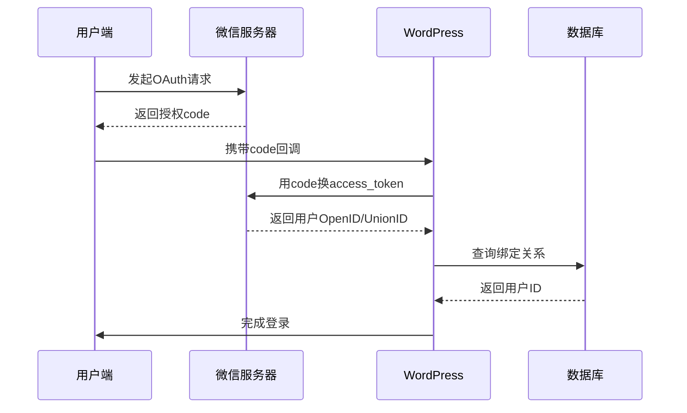

 

---

### **WordPress多站点集成WooCommerce多方式登录插件需求文档**

---

### **一、核心功能模块**
#### 1. 用户注册系统
**补充项：**
- **账号绑定机制**：支持同一用户多方式绑定（微信/手机/邮箱）
- **防重复校验**：手机号/邮箱全局唯一性验证（跨多站点需配置共享模式）
- **隐私政策**：注册流程增加条款勾选（内容后台可配）
- **验证码管理**：验证码有效期（默认5分钟）、重发间隔（60秒）可配置

**多端注册规则：**
- **通用功能**：
  - 原生邮箱注册（保留WooCommerce原生表单）
  - 短信验证注册（强制要求绑定邮箱）
  - 自动生成用户名规则可配置（如：`user_手机尾号4位`）

- **桌面端**：
  - 微信扫码注册 → 强制绑定手机 + 邮箱
  - 微信新用户自动创建账号

- **移动端**：
  - 浏览器环境：调用微信快捷登录 → 绑定手机+邮箱
  - 微信内环境：静默授权登录 → 强制补全手机+邮箱

#### 2. 登录系统
**安全增强：**
- 失败尝试锁定（5次错误锁定15分钟）
- 设备识别（可选开启异地登录验证）

**多端登录规则：**
- **桌面端**：
  - 密码登录（支持账号/手机/邮箱）
  - 短信验证码登录
  - 微信扫码登录（状态保持30天）

- **移动网页端**：
  - 密码登录 + 短信登录
  - 微信登录唤起APP授权

- **微信内环境**：
  - 自动静默登录（通过OpenID）
  - 手动切换账号功能

#### 3. 密码重置系统
- **多途径验证**：
  - 手机号：短信验证码+新密码设置
  - 邮箱：标准WooCommerce重置流程
  - 账号：需通过关联手机/邮箱验证
- **安全防护**：重置链接有效期（24小时）、单日尝试次数限制（5次）

---

### **二、技术实现规范**
#### 1. 短信网关集成
- **多服务商支持**：阿里云、腾讯云、Twilio等（可切换）
- **模板管理**：
  ```php
  // 示例模板变量
  "注册验证码：{code}，有效期{minutes}分钟"
  "登录验证码：{code}，如非本人操作请忽略"
  ```
- **频控策略**：同一手机号每日最大发送量（默认10条）

#### 2. 微信生态集成
- **多公众号支持**：通过AppID/Secret切换不同站点
- **UnionID机制**：优先使用UnionID识别用户
- **Scope控制**：
  - 静默登录：snsapi_base
  - 显式授权：snsapi_userinfo

#### 3. 数据存储规范
- **元数据存储**：
  - `billing_phone` → WooCommerce标准字段
  - `wechat_openid` → 加密存储
  - `phone_verified` → 布尔值验证状态

---

### **三、后台管理系统**
#### 1. 模块化控制面板
```markdown
- [x] 启用邮箱注册 
- [x] 启用短信验证注册 
- [ ] 启用微信登录（桌面端）
- [x] 启用微信登录（移动端）
- [ ] 启用国际号码支持
```

#### 2. 参数配置项
- **短信设置**：API密钥、签名、模板ID
- **微信设置**：AppID/Secret、强制绑定开关
- **验证规则**：密码强度要求、手机号正则表达式

#### 3. 安全审计模块
- 实时日志查看器（显示API调用记录）
- 敏感操作审计（如用户绑定解绑）
- 数据清理工具（GDPR合规）

---

### **四、关键补充需求**
1. **国际化支持**：
   - 手机号区号选择（前端组件）
   - 多语言文案管理系统

2. **合规性要求**：
   - GDPR数据导出/删除接口
   - 同意记录存储（条款版本+时间戳）

3. **性能优化**：
   - 短信验证码缓存机制（Redis/Memcached）
   - 数据库索引优化（针对`phone`字段）

4. **异常处理**：
   - 微信授权异常回退方案
   - 短信服务商故障切换机制

---

### **五、开发规范**
1. **代码标准**：
   - 遵循[WordPress VIP规范](https://developer.wordpress.com/vip/guidelines/)
   - 使用WooCommerce原生表单钩子（如`woocommerce_register_form`）

2. **安全规范**：
   - 所有前端API使用nonce验证
   - 敏感数据加密存储（使用OpenSSL）

3. **扩展性设计**：
   ```php
   add_filter('wechat_auth_scopes', function($scopes){
       return apply_filters('custom_auth_scopes', $scopes);
   }); // 允许其他插件修改授权范围
   ```

---

### **六、测试用例要求**
1. **边界测试**：
   - 11位手机号含国际区号场景
   - 微信已绑定用户尝试重复注册

2. **压力测试**：
   - 500并发下的短信接口响应
   - 多站点同时写入用户数据

3. **兼容性测试**：
   - 与流行插件（如Membership）的冲突检测
   - WooCommerce 5.0+版本适配

---

---

### **详细技术实现方案**

---

#### **一、用户注册系统实现**
**1. 多端注册流程整合**
- **Hook接入点**：
  ```php
  // 接管WooCommerce注册表单
  add_action('woocommerce_register_form', 'add_sms_wechat_fields');
  
  // 注册验证钩子
  add_filter('woocommerce_registration_errors', 'validate_registration_data', 10, 3);
  
  // 用户创建后处理
  add_action('woocommerce_created_customer', 'handle_post_registration', 10, 3);
  ```

- **数据结构设计**：
  ```php
  // 用户元数据表扩展
  +----------------+------------------+------+-----+
  | meta_key       | meta_value       | user_id |
  +----------------+------------------+---------+
  | phone_verified | 1                | 123     |
  | wechat_unionid | o6_bm************| 123     |
  | sms_code_cache | {"code":"8293"...| 123     |
  +----------------+------------------+---------+
  ```

**2. 短信验证码实现**
- **缓存机制**：
  ```php
  // 使用Transient API存储验证码（示例）
  set_transient(
    'sms_code_' . $phone, 
    json_encode([
      'code' => $generated_code,
      'expire' => time() + 300 // 5分钟有效期
    ]), 
    300
  );
  ```

- **服务商抽象层**：
  ```php
  interface SMS_Gateway {
    public function send($phone, $template_id, $params);
  }
  
  class Aliyun_SMS implements SMS_Gateway {
    // 实现阿里云SDK调用
  }
  
  class Twilio_SMS implements SMS_Gateway {
    // 实现Twilio API调用
  }
  ```

---

#### **二、微信登录深度集成**
**1. 授权流程设计**


**2. 多环境处理策略**
- **微信内静默登录**：
  ```js
  // 通过UA判断微信环境
  function is_wechat_browser() {
    return /MicroMessenger/i.test(navigator.userAgent);
  }
  
  // 自动跳转授权URL
  if(is_wechat_browser() && !is_user_logged_in()) {
    window.location.replace(wechat_oauth_url);
  }
  ```

- **跨站点共享登录**：
  ```php
  // 使用WP原生switch_to_blog()
  foreach(get_sites() as $site) {
    switch_to_blog($site->blog_id);
    // 检查用户是否存在
    restore_current_blog();
  }
  ```

---

#### **三、安全增强方案**
**1. 数据加密存储**
```php
// 使用OpenSSL加密敏感数据
function encrypt_data($data) {
  $iv = openssl_random_pseudo_bytes(16);
  return base64_encode($iv . openssl_encrypt(
    $data, 
    'aes-256-cbc', 
    SECURE_KEY, 
    0, 
    $iv
  ));
}
```

**2. 暴力破解防护**
```php
// 登录失败记录
add_filter('wp_login_errors', function($errors) {
  $failed_attempts = get_transient('login_fails_'.$_SERVER['REMOTE_ADDR']);
  if($failed_attempts >= 5) {
    $errors->add('locked', __('账户已锁定，请15分钟后再试'));
  }
  return $errors;
});
```

---

#### **四、后台管理系统实现**
**1. 模块化设置界面**
```php
// 使用WordPress Settings API构建
add_menu_page(
  '多方式登录设置',
  '登录管理',
  'manage_options',
  'multi-login-settings',
  'render_settings_page'
);

function render_settings_page() {
  ?>
  <div class="wrap">
    <h2>模块控制</h2>
    <form method="post" action="options.php">
      <?php 
        settings_fields('multi_login_modules'); 
        do_settings_sections('multi_login_modules');
      ?>
      <table class="form-table">
        <tr>
          <th>启用短信注册</th>
          <td>
            <input type="checkbox" name="sms_enabled" 
              <?php checked(get_option('sms_enabled'), 1); ?>>
          </td>
        </tr>
      </table>
      <?php submit_button(); ?>
    </form>
  </div>
  <?php
}
```

**2. 实时日志查看器**
```php
// 集成WooCommerce日志系统
add_filter('woocommerce_status_log_handlers', function($handlers) {
  $handlers[] = new WC_Log_Handler_DB();
  return $handlers;
});

// 自定义日志条目
$logger = wc_get_logger();
$logger->info('短信发送成功', [
  'source' => 'multi-login',
  'phone' => $sanitized_phone
]);
```

---

#### **五、性能优化策略**
**1. 数据库索引优化**
```sql
-- 在wp_usermeta表添加复合索引
ALTER TABLE wp_usermeta 
ADD INDEX meta_phone (meta_key(20), meta_value(20))
WHERE meta_key IN ('billing_phone', 'phone_verified');

-- 使用EXPLAIN分析查询
EXPLAIN SELECT user_id 
FROM wp_usermeta 
WHERE meta_key = 'billing_phone' 
  AND meta_value = '13800138000';
```

**2. 对象缓存集成**
```php
// 缓存微信用户信息
wp_cache_add($unionid, $user_data, 'wechat_users', 3600);

// 获取缓存数据
if($cached = wp_cache_get($unionid, 'wechat_users')) {
  return $cached;
}
```

---

#### **六、异常处理机制**
**1. 微信授权失败处理**
```php
try {
  $wechat_user = $api->getUserInfo($access_token);
} catch (WechatException $e) {
  // 记录异常日志
  $logger->error('微信授权失败: '.$e->getMessage());
  
  // 回退到备用登录方式
  wp_redirect(add_query_arg('login_fallback', '1', wc_get_page_permalink('myaccount')));
  exit;
}
```

**2. 短信服务降级方案**
```php
// 使用策略模式实现故障切换
function get_sms_gateway() {
  $primary = new Aliyun_SMS();
  if(!$primary->health_check()) {
    return new Tencent_SMS(); // 切换到备用服务商
  }
  return $primary;
}
```

---

### **待确认关键决策点**
1. **多站点用户同步策略**：
   - 方案A：中央用户数据库（共享用户表）
   - 方案B：各站点独立用户+主站绑定（推荐）
   - 方案C：使用WordPress原生的多站点用户体系

2. **微信用户合并逻辑**：
   ```php
   // 当检测到同一UnionID时：
   if($existing_user = get_user_by_unionid($unionid)) {
     // 合并操作
     $this->merge_accounts($current_user, $existing_user);
   }
   ```

3. **国际号码处理方案**：
   - 使用`libphonenumber`库解析格式
   - 数据库存储标准化E.164格式

--- 

 **第一部分：跨站点用户同步实现**：

---

### **关键功能代码原型 - Part 1/4**

#### **1. 多站点用户同步核心逻辑**
```php
// File: includes/class-multisite-sync.php

class Multisite_User_Sync {
    
    /**
     * 在主站创建用户后同步到其他站点
     * @hook wpmu_activate_user
     */
    public function sync_new_user($user_id, $password, $meta) {
        if (!is_multisite()) return;
        
        $primary_blog_id = get_current_blog_id();
        
        // 获取所有子站点
        $sites = get_sites(['exclude' => $primary_blog_id]);
        
        foreach ($sites as $site) {
            switch_to_blog($site->blog_id);
            
            // 检查用户是否已存在
            if (!get_user_by('id', $user_id)) {
                // 添加用户到子站点
                add_existing_user_to_blog([
                    'user_id' => $user_id,
                    'role'    => get_option('default_role')
                ]);
                
                // 同步元数据
                $this->sync_user_meta($user_id, $meta);
            }
            
            restore_current_blog();
        }
    }
    
    /**
     * 同步用户元数据规则
     */
    private function sync_user_meta($user_id, $meta) {
        $sync_keys = apply_filters('multisite_sync_meta_keys', [
            'billing_phone',
            'phone_verified',
            'wechat_unionid'
        ]);
        
        foreach ($sync_keys as $key) {
            if (isset($meta[$key])) {
                update_user_meta($user_id, $key, $meta[$key]);
            }
        }
    }
}

// 初始化
add_action('plugins_loaded', function() {
    $sync = new Multisite_User_Sync();
    add_action('wpmu_activate_user', [$sync, 'sync_new_user'], 10, 3);
});
```

#### **2. 站点切换登录状态保持**
```php
// File: includes/class-cross-site-login.php

add_action('set_logged_in_cookie', function($logged_in_cookie) {
    // 统一主站与子站cookie设置
    $_COOKIE[LOGGED_IN_COOKIE] = $logged_in_cookie;
});

add_filter('auth_cookie', function($cookie, $user_id, $expiration) {
    // 跨站点共享认证cookie
    $cookie['path'] = '/';
    $cookie['domain'] = COOKIE_DOMAIN;
    return $cookie;
}, 10, 3);
```

#### **3. 用户查询增强**
```php
// File: includes/class-user-query.php

add_filter('pre_get_site_by_path', function($site, $domain, $path, $segments) {
    // 允许通过手机号查询用户
    if (is_phone_number($domain)) {
        return get_user_site_by_phone($domain);
    }
    return $site;
}, 10, 4);

function get_user_site_by_phone($phone) {
    global $wpdb;
    
    $user_id = $wpdb->get_var($wpdb->prepare(
        "SELECT user_id FROM {$wpdb->usermeta} 
        WHERE meta_key = 'billing_phone' 
        AND meta_value = %s", 
        $phone
    ));
    
    return get_site(get_user_main_site($user_id));
}
```


--------------------

### **关键功能代码原型 - Part 2/4**

---

#### **4. 短信验证核心模块**
```php
// File: includes/sms/class-sms-core.php

class WC_SMS_Verification {
    const PREFIX = 'wc_sms_';

    /**
     * 发送验证码主逻辑
     */
    public function send_code($phone) {
        // 频率控制检查
        if ($this->is_flooding($phone)) {
            throw new Exception('请求过于频繁，请稍后重试');
        }

        // 生成6位数字验证码
        $code = wp_rand(100000, 999999);
        
        // 存储验证码（加密存储）
        set_transient(
            self::PREFIX . md5($phone),
            wp_hash_password($code),
            $this->get_code_expiry()
        );

        // 调用网关发送
        $gateway = $this->get_active_gateway();
        return $gateway->send(
            $phone,
            get_option('wc_sms_template_reg'),
            ['code' => $code]
        );
    }

    /**
     * 验证码校验
     */
    public function verify_code($phone, $input_code) {
        $hashed_code = get_transient(self::PREFIX . md5($phone));
        
        // 验证有效性
        return $hashed_code && 
               wp_check_password($input_code, $hashed_code);
    }

    /**
     * 获取当前启用的网关
     */
    private function get_active_gateway() {
        $gateways = [
            'aliyun' => 'WC_Aliyun_SMS',
            'tencent' => 'WC_Tencent_SMS'
        ];
        
        $active = get_option('wc_sms_active_gateway');
        return new $gateways[$active]();
    }
}
```

#### **5. 阿里云短信网关实现**
```php
// File: includes/sms/gateways/class-aliyun-sms.php

class WC_Aliyun_SMS {
    public function send($phone, $template_id, $params) {
        $config = [
            'access_key' => get_option('wc_sms_aliyun_key'),
            'secret' => get_option('wc_sms_aliyun_secret'),
            'sign_name' => get_option('wc_sms_aliyun_sign')
        ];

        $client = new Aliyun\Core\DefaultAcsClient(
            new Aliyun\Core\Profile\DefaultProfile(
                $config['access_key'],
                $config['secret']
            )
        );

        $request = new Aliyun\Api\Sms\Request\V20170525\SendSmsRequest();
        $request->setPhoneNumbers($phone);
        $request->setTemplateCode($template_id);
        $request->setTemplateParam(json_encode($params));
        $request->setSignName($config['sign_name']);

        try {
            $response = $client->getAcsResponse($request);
            return $response->Code === 'OK';
        } catch (Exception $e) {
            wc_get_logger()->error('阿里云短信异常: ' . $e->getMessage());
            return false;
        }
    }
}
```

#### **6. 频率控制实现**
```php
// File: includes/sms/class-sms-anti-flood.php

class WC_SMS_Flood_Control {
    public function is_flooding($phone) {
        $last_sent = get_transient('wc_sms_last_sent_' . $phone);
        $retry_window = get_option('wc_sms_retry_interval', 60);

        // 60秒内不允许重复发送
        if ($last_sent && (time() - $last_sent) < $retry_window) {
            return true;
        }

        // 记录本次发送时间
        set_transient('wc_sms_last_sent_' . $phone, time(), $retry_window);
        return false;
    }

    public function daily_limit_check($phone) {
        $count_key = 'wc_sms_daily_' . date('Ymd') . '_' . $phone;
        $count = get_transient($count_key) ?: 0;
        
        $max_daily = get_option('wc_sms_max_daily', 10);
        if ($count >= $max_daily) {
            throw new Exception('今日验证码发送已达上限');
        }

        set_transient($count_key, $count + 1, DAY_IN_SECONDS);
    }
}
```
 
